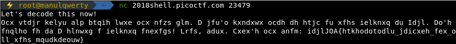
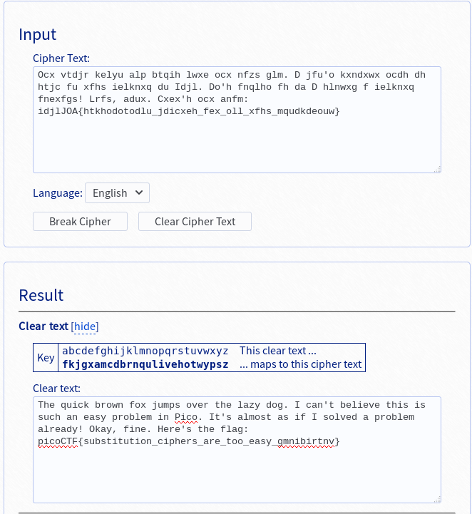

# hertz 2
**Points: 200**

## Cryptography

## Question
>This flag has been encrypted with some kind of cipher, can you decrypt it? Connect with nc 2018shell.picoctf.com 23479.

### Hint
>These kinds of problems are solved with a frequency that merits some analysis.

## Solution
```bash
nc 2018shell.picoctf.com 23479
```




### Flag
`picoCTF{substitution_ciphers_are_too_easy_gmnibirtnv}`
