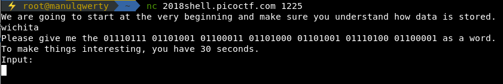

# what base is this?
**Points: 200**

## General Skills

## Question
>To be successful on your mission, you must be able read data represented in different ways, such as hexadecimal or binary. Can you get the flag from this program to prove you are ready? Connect with nc 2018shell.picoctf.com 1225 .

### Hint
>I hear python is a good means (among many) to convert things - It might help to have multiple windows open

## Solution
```bash
nc 2018shell.picoctf.com 1225
```


We have to decode the 3 codes: binary to text, hex to text and oct to text

```python
#!/usr/bin/env python2
from pwn import *

def bin2str(s):
    return ''.join(chr(int(s[i*8:i*8+8],2)) for i in range(len(s)//8))

def oct2str(s):
    s = s.replace(" ", "\\")
    return s.decode('string_escape')

host = '2018shell.picoctf.com'
port = 1225

p = remote(host, port)
r = p.recv()
m = re.search('Please give me the (.+?) as a word.', r)
p.sendline(bin2str(m.group(1).replace(" ", "")))
r = p.recv()
m = re.search('Please give me the (.+?) as a word.', r)
p.sendline(m.group(1).decode('hex'))
r = p.recv()
m = re.search('Please give me the (.+?) as a word.', r)
p.sendline(oct2str(m.group(1)))
print p.recv()
```
### Flag
`picoCTF{delusions_about_finding_values_451a9a74}`
