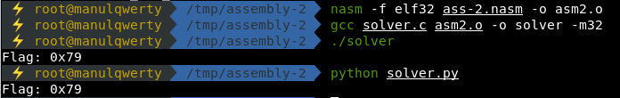

# assembly-2
**Points: 250**

## Reversing

## Question
>What does asm2(0x4,0x2d) return? Submit the flag as a hexadecimal value (starting with '0x'). NOTE: Your submission for this question will NOT be in the normal flag format. Source located in the directory at /problems/assembly-2_2_39150748a2771e0f5d2cbb14351ba582. 
```asm
.intel_syntax noprefix
.bits 32
	
.global asm2

asm2:
	push   	ebp
	mov    	ebp,esp
	sub    	esp,0x10
	mov    	eax,DWORD PTR [ebp+0xc]
	mov 	DWORD PTR [ebp-0x4],eax
	mov    	eax,DWORD PTR [ebp+0x8]
	mov	DWORD PTR [ebp-0x8],eax
	jmp    	part_b
part_a:	
	add    	DWORD PTR [ebp-0x4],0x1
	add	DWORD PTR [ebp+0x8],0x64
part_b:	
	cmp    	DWORD PTR [ebp+0x8],0x1d89
	jle    	part_a
	mov    	eax,DWORD PTR [ebp-0x4]
	mov	esp,ebp
	pop	ebp
	ret
```
### Hint
>assembly conditions

## Solution
We can  solve this challenge easily executing the asm.
### Method 1
- 1. Convert to nasm syntax
```asm
section .text
    global asm2

asm2:
	push   	ebp
	mov    	ebp,esp
	sub    	esp,0x10
	mov    	eax,DWORD [ebp+0xc]
	mov 	DWORD [ebp-0x4],eax
	mov    	eax,DWORD [ebp+0x8]
	mov	    DWORD [ebp-0x8],eax
	jmp    	part_b
part_a:	
	add    	DWORD [ebp-0x4],0x1
	add	DWORD [ebp+0x8],0x64
part_b:	
	cmp    	DWORD [ebp+0x8],0x1d89
	jle    	part_a
	mov    	eax,DWORD [ebp-0x4]
	mov	esp,ebp
	pop	ebp
	ret
```
- 2. Create a solver.c:
```c
#include <stdio.h>
extern int asm2(int a, int b);

int main(int argc, char *argv[]) {

	printf("Flag: 0x%x\n", asm2(0x4,0x2d));
	return 0;
}
```
- 3. Compile and run the code
```bash
~ nasm -f elf32 ass-2.nasm -o asm2.o
~ gcc solver.c asm2.o -o solver -m32
~ ./solver
Flag: 0x79
```
### Method 2
Following the code:
> asm2(0x4,0x2d)
```asm
asm2:
	push   	ebp
	mov    	ebp,esp
	sub    	esp,0x10
	mov    	eax,DWORD PTR [ebp+0xc]
	mov 	DWORD PTR [ebp-0x4],eax ; DWORD PTR [ebp-0x4] == 0x4
	mov    	eax,DWORD PTR [ebp+0x8]
	mov	    DWORD PTR [ebp-0x8],eax ; DWORD PTR [ebp-0x8] == 0x2d
	jmp    	part_b
    
part_b:	
	cmp    	DWORD [ebp+0x8],0x1d89 ; compare 0x2d with 0x1d89
	jle    	part_a                 ; jump to part_a (0x2d <= 0x1d89)

part_a:	
	add    	DWORD PTR [ebp-0x4],0x1 ; DWORD [ebp-0x4] = 0x4 + 0x1 = 0x5
	add	    DWORD PTR [ebp+0x8],0x64 ; DWORD PTR [ebp+0x8] = 0x2d + 0x64 = 0x91
```
> while DWORD [ebp+0x8] <= 0x1d89: DWORD PTR [ebp-0x4] += 1

So we can solve this easly with a script python:
```python
#  asm2(0x4,0x2d)
a = 0x2d
for i in range(0x4, 0x1d89, 0x64):
    a += 0x1

print('Flag: 0x%x' % a)
```

### Flag
`0x79`
