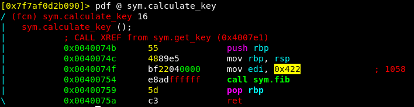
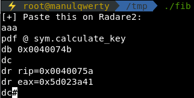
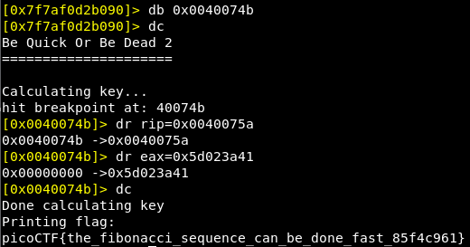

# be-quick-or-be-dead-2
**Points: 275**

## Reversing

## Question
>As you enjoy this music even more, another executable be-quick-or-be-dead-2 shows up. Can you run this fast enough too? You can also find the executable in /problems/be-quick-or-be-dead-2_3_bc41c1e2cd88c0e9d8a8d0cb851f91e9.

### Hint
>Can you call stuff without executing the entire program? - What will the key finally be?

## Solution
This challenge is pretty similar to [be-quick-or-be-dead-1](https://github.com/manulqwerty/picoCTF-2018-WriteUp/tree/master/Reversing/be-quick-or-be-dead-1) but in this ocasion we can't solve it just not calling **set_timer()**
```c
main(void)
{
  header();
  set_timer();
  get_key();
  print_flag();
  return 0;
}
```
To get the flag the program calculates fibonacci of 0x422:



But it uses a slow algorithm so we can calculate it and replace the value on execution time.
I've created a program to do that:
```c
#include <stdio.h>
int main(int argc, char *argv[])
{
    int i, n = 1058, t1 = 0, t2 = 1, nextTerm;

    for (i = 1; i <= n; ++i)
    {
        nextTerm = t1 + t2;
        t1 = t2;
        t2 = nextTerm;
    }
    printf("[+] Paste this on Radare2:\n");
    printf("aaa\npdf @ sym.calculate_key\ndb 0x0040074b\ndc\ndr rip=0x0040075a\ndr eax=0x%x\ndc", t1);
    return 0;
}
```


As the program says, we only have to paste that on Radare:


### Flag
`picoCTF{the_fibonacci_sequence_can_be_done_fast_85f4c961}`
