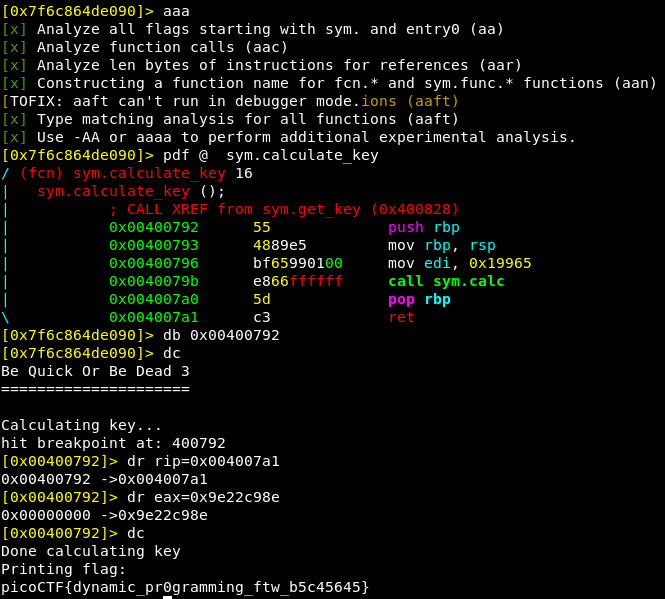

# be-quick-or-be-dead-3
**Points: 350**

## Reversing

## Question
>As the song draws closer to the end, another executable be-quick-or-be-dead-3 suddenly pops up. This one requires even faster machines. Can you run it fast enough too? You can also find the executable in /problems/be-quick-or-be-dead-3_2_fc35b1f6832df902b8e2f724772d012f. 

### Hint
>How do you speed up a very repetitive computation?

## Solution
Let's decompile the program:
```c
main(void)
{
  header();
  set_timer();
  get_key();
  print_flag();
  return 0;
}

void get_key(void)
{
  puts("Calculating key...");
  key = calculate_key();
  puts("Done calculating key");
  return;
}

void calculate_key(void)
{
  calc(0x19965);
  return;
}

ulong calc(uint init_value)
{
  ulong uVar1;
  ulong uVar2;
  ulong uVar3;
  ulong uVar4;
  ulong uVar5;
  uint final;
  
  if (init_value < 5) {
    final = init_value * init_value + 0x2345;
  }
  else {
    uVar1 = calc(init_value - 1);
    uVar2 = calc(init_value - 2);
    uVar3 = calc(init_value - 3);
    uVar4 = calc(init_value - 4);
    uVar5 = calc(init_value - 5);
    final = (int)uVar5 * 0x1234 + ((int)uVar1 - (int)uVar2) + ((int)uVar3 - (int)uVar4);
  }
  return (ulong)final;
}
```
As you see, we have to calculate **calc(0x19965)** but this will take too much time because most of the operations will be repited.

So we can't just replicate the algorithm, we have to check if that value has been already calculated. Let's do it with a python dictionary:

```python
import ctypes
inp = 0x19965
mem = {}

def calc(init_value):
    if init_value in mem:
        return mem[init_value]
        
    if init_value < 5:
        final = init_value * init_value + 0x2345
    else:
        var1 = calc(init_value - 1)
        var2 = calc(init_value - 2)
        var3 = calc(init_value - 3)
        var4 = calc(init_value - 4)
        var5 = calc(init_value - 5)
        final = var5 * 0x1234 + (var1 - var2) + (var3 - var4)
    
    mem[init_value] = final    
    return final

for i in range (inp):
    calc(i)

print ('[+] Result: 0x%x' % ctypes.c_uint32(calc(inp)).value)
```

Now we can resolve it easily as the previous challenges:


### Flag
`picoCTF{dynamic_pr0gramming_ftw_b5c45645}`
