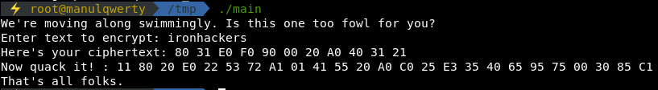
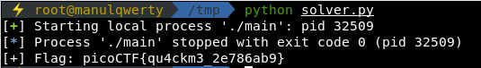

# quackme up
**Points: 350**

## Reversing

## Question
>The duck puns continue. Can you crack, I mean quack this program as well? You can find the program in /problems/quackme-up_2_bf9649c854a2615a35ccdc3660a31602 on the shell server. 

### Hint
>

## Solution

#### Main
```c
 main(void)

{
  char *__block;
  undefined4 extraout_EAX;
  int __edflag;
  
  puts("We\'re moving along swimmingly. Is this one too fowl for you?");
  printf("Enter text to encrypt: ");
  __block = (char *)read_input();
  encrypt(__block,__edflag);
  printf("Here\'s your ciphertext: ");
  print_hex(__block,extraout_EAX);
  printf("Now quack it! : %s\n",encryptedBuffer);
  puts("That\'s all folks.");
  return 0;
}
```
#### Encrypt
```c
void encrypt(char *__block,int __edflag)

{
  byte bVar1;
  char cVar2;
  size_t sVar3;
  int local_14;
  
  sVar3 = strlen(__block);
  local_14 = 0;
  while (local_14 < (int)sVar3) {
    bVar1 = rol4((int)__block[local_14]);
    cVar2 = ror8((int)(char)(bVar1 ^ 0x16));
    __block[local_14] = cVar2;
    local_14 = local_14 + 1;
  }
  return;
}
```
#### Execution example


#### How to solve it
We can encode all the characters and then decode the flag:

```python
import string
from pwn import *

text_in = string.printable
p = process('./main')
p.recvline()
p.sendline(text_in)
ciphertext = p.recvline()
m = re.search('Here\'s your ciphertext: (.*)', ciphertext)
ciphertext = m.group(1)
cipher = ciphertext.split(' ')
p.recvuntil('Now quack it! : ')
flag = p.recvline().strip().split(' ')
p.close()  

cipher_dicc = {}
for a, b in zip(cipher, text_in):
    cipher_dicc[a] = b

print ('[+] Flag: %s' % (''.join( cipher_dicc[i] for i in flag)))
```


### Flag
`picoCTF{qu4ckm3_2e786ab9}`
