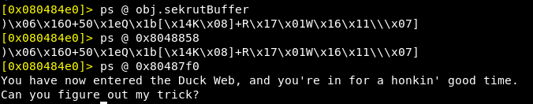
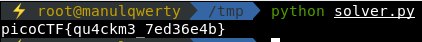

# quackme
**Points: 200**

## Reversing

## Question
>Can you deal with the Duck Web? Get us the flag from this program. You can also find the program in /problems/quackme_3_9a15a74731538ce2076cd6590cf9e6ca.

### Hint
>Objdump or something similar is probably a good place to start.

## Solution
Let's dissamble the program:
```c
main(void)
{
  setvbuf(stdout,(char *)0x0,2,0);
  puts(
      "You have now entered the Duck Web, and you\'re in for a honkin\' good time.\nCan you figureout my trick?"
      );
  do_magic();
  puts("That\'s all folks.");
  return 0;
}
```
```c
void do_magic(void)

{
  char *input_string;
  size_t input_length;
  void *__s;
  int length;
  int i;
  
  input_string = (char *)read_input();
  input_length = strlen(input_string);
  __s = malloc(input_length + 1);
  if (__s == (void *)0x0) {
    puts("malloc() returned NULL. Out of Memory\n");
    exit(-1);
  }
  memset(__s,0,input_length + 1);
  length = 0;
  i = 0;
  while( true ) {
    if ((int)input_length <= i) {
      return;
    }
    // sekrutBuffer = ")\x06\x16O+50\x1eQ\x1b[\x14K\b]+R\x17\x01W\x16\x11\\\a]"
    if (greetingMessage[i] == (char)(input_string[i] ^ sekrutBuffer[i])) {
      length = length + 1;
    }
    if (length == 0x19) break;
    i = i + 1;
  }
  puts("You are winner!");
  return;
}
```
Let's get the value of greetingMessage and sekrutBuffer using Radare2:
```
r2 main
aaa
pdf @ sym.do_magic
```
```
0x080486c0  add eax, obj.sekrutBuffer   ; 0x8048858 
0x080486d8  mov edx, dword obj.greetingMessage ; [0x804a038:4]=0x80487f0 
```
```
ps @ obj.sekrutBuffer
ps @ 0x8048858
ps @ 0x80487f0
```

```python
sekrutBuffer = ')\x06\x16O+50\x1eQ\x1b[\x14K\b]+R\x17\x01W\x16\x11\\\a]'
greetingMessage = 'You have now entered the Duck Web, and you\'re in for a honkin\' good time.'
flag = ''

for i in range(0x19):
    flag += chr(ord(sekrutBuffer[i]) ^ ord(greetingMessage[i]))
    
print flag
```


### Flag
`picoCTF{qu4ckm3_7ed36e4b}`
